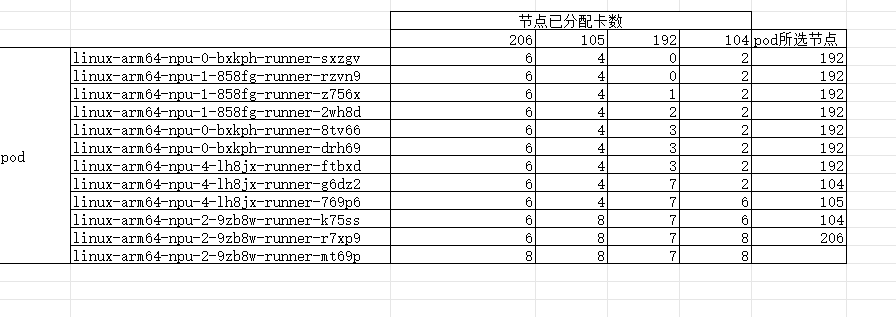

# 测试调度器
[测试 github action](https://github.com/cllouud/vllm-ascend/actions/runs/15579516815/job/43871254090)

选取0卡，1卡，2卡，4卡job，各3个，共12个job。不限制并发数。

运行结果：

调度器依次调度12个pod。
前7个pod均调度到192节点。此时192节点已分配7卡。
对于两个4卡pod，先后将其分配到有足够资源的104，105节点。
对于两个2卡pod，先后将其分配到有足够资源的104，206节点。
对于最后2卡pod，没有节点有足够资源，pod处于pending状态。

解决了`部分 node 的NPU资源没有被充分使用`的问题。

# 测试label正确
运行如下脚本，验证autoscalingrunnerset资源的`ascend-ci.com/required-npu-count`标签值正确。
```bash
#!/bin/bash
export KUBECONFIG=$1

# 执行kubectl命令并处理输出
kubectl get autoscalingrunnerset --all-namespaces --no-headers \
  -o custom-columns='NAME:.metadata.name,NAMESPACE:.metadata.namespace,NPUCOUNT:.spec.template.metadata.labels.ascend-ci\.com\/required-npu-count' \
  | while read -r name namespace npucount; do
      # 提取名称中的最后一个数字段
      last_segment="${name##*-}"
      # 验证数字段与NPUCOUNT是否匹配
      if [[ "$last_segment" != "$npucount" ]]; then
        printf "ERROR: Name: %s Namespace: %s NPUCOUNT: %s \n" \
               "$name" "$namespace" "$npucount"
      else
        printf "OK: Name: %s Namespace: %s NPUCOUNT: %s \n" \
               "$name" "$namespace" "$npucount"
      fi
    done
```
运行结果
```
OK: Name: linux-arm64-npu-1 Namespace: ascend NPUCOUNT: 1
OK: Name: linux-arm64-npu-2 Namespace: ascend NPUCOUNT: 2
OK: Name: linux-arm64-npu-4 Namespace: ascend NPUCOUNT: 4
OK: Name: linux-arm64-npu-0 Namespace: cllouud NPUCOUNT: 0
OK: Name: linux-arm64-npu-1 Namespace: cllouud NPUCOUNT: 1
OK: Name: linux-arm64-npu-2 Namespace: cllouud NPUCOUNT: 2
OK: Name: linux-arm64-npu-4 Namespace: cllouud NPUCOUNT: 4
OK: Name: linux-arm64-npu-2 Namespace: clouud NPUCOUNT: 2
OK: Name: linux-arm64-npu-0 Namespace: cosdt NPUCOUNT: 0
OK: Name: linux-arm64-npu-1 Namespace: cosdt NPUCOUNT: 1
OK: Name: linux-arm64-npu-2 Namespace: cosdt NPUCOUNT: 2
OK: Name: linux-arm64-npu-0 Namespace: nv-action NPUCOUNT: 0
OK: Name: linux-arm64-npu-1 Namespace: nv-action NPUCOUNT: 1
OK: Name: linux-arm64-npu-2 Namespace: nv-action NPUCOUNT: 2
OK: Name: linux-arm64-npu-4 Namespace: nv-action NPUCOUNT: 4
OK: Name: linux-arm64-npu-8 Namespace: nv-action NPUCOUNT: 8
OK: Name: linux-arm64-npu-0 Namespace: pytorch-fdn NPUCOUNT: 0
OK: Name: linux-arm64-npu-1 Namespace: pytorch-fdn NPUCOUNT: 1
OK: Name: linux-arm64-npu-2 Namespace: pytorch-fdn NPUCOUNT: 2
OK: Name: linux-arm64-npu-4 Namespace: pytorch-fdn NPUCOUNT: 4
OK: Name: linux-arm64-npu-1 Namespace: vllm-project NPUCOUNT: 1
OK: Name: linux-arm64-npu-2 Namespace: vllm-project NPUCOUNT: 2
OK: Name: linux-arm64-npu-4 Namespace: vllm-project NPUCOUNT: 4
OK: Name: linux-arm64-npu-8 Namespace: vllm-project NPUCOUNT: 8
```
