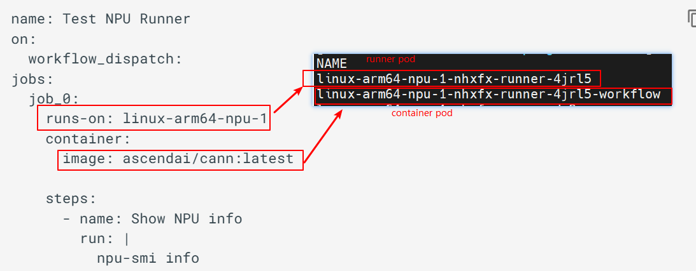

# 背景
[Github ARC](https://github.com/actions/actions-runner-controller/) 执行 [ascend-gha-runners](https://ascend-gha-runners.github.io/docs/)时，如果指定了`container.image`字段，那么将部署2个 pod，一个是 runner pod，不带NPU卡。一个是container pod，带NPU卡。


调度器优先调度 runner pod，而 runner pod 本身不申请NPU资源，导致调度器调度 runner pod 时不考虑NPU资源。
container pod 由 runner pod 生成，且必须和 runner pod 在同一个 node 上。
因此可能出现部分 node 的NPU资源没有被充分使用。

# 解决方案
## runner pod 添加 label
```yaml
ascend-ci.com/required-npu-count: "x"
```
x是container pod 申请的NPU卡数。

## 自定义调度器
根据节点上pod的label计算节点实际已分配的NPU卡数，将 runner pod 在节点间均匀分配，避免资源浪费。

# 源码解析
分支名称不是main，而是release-1.28。原因是后台集群的k8s版本是1.28.
`cmd/scheduler/main.go`是主函数，负责启动调度器。
`pkg/runnerpodnpu/runner_pod_npu.go`是自定义调度器的核心代码。
`deploy/`是部署自定义调度器所需的k8s资源。

# 部署自定义调度器
1. 将当前分支打包为dockerhub镜像，参考[Pull Request](https://github.com/ascend-gha-runners/scheduler-plugins/pull/1)
2. 将`/deploy/deployment.yaml`的镜像改为打包后的镜像
3. 部署`/deploy`目录的资源


# 使用方法
## 配置 runner scale set 的 label
部署`runner scale set` chart 时
1. [配置labels](https://github.com/actions/actions-runner-controller/blob/master/charts/gha-runner-scale-set/templates/autoscalingrunnerset.yaml#L123)
2. [配置自定义调度器](https://kubernetes.io/docs/tasks/extend-kubernetes/configure-multiple-schedulers/)
```yaml
template:
    metadata:
      labels:
        ascend-ci.com/required-npu-count: "2"
    spec:
      schedulerName: runner-pod-npu-scheduler
```
