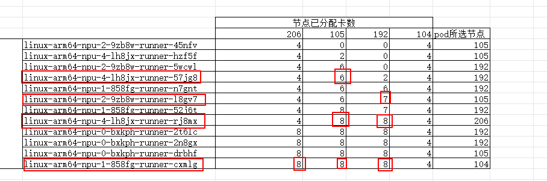

# 测试场景
`runner scheduler`版本为[v1.0.1](https://github.com/ascend-gha-runners/scheduler-plugins/releases/tag/v1.0.1)，将其打包成镜像并部署到K8S集群。


本地测试 [github action](https://github.com/cllouud/vllm-ascend/actions/runs/15608341152)
同时触发0卡，1卡，2卡，4卡job，各3个，共12个job。
不限制并发数。
12个job均由`runner scheduler v1.0.1`调度。

# 测试结果
1. 如果某节点存在空闲资源，那么调度器可以将`runner pod`分配到空闲节点。
不会出现多个`runner pod`堵在同一个节点的情况。
解决了`部分 node 的NPU资源没有被充分使用`的问题。

2. 所有`runner pod`的标签都配置正确。

3. 所有`node`的标签都配置正确。

# 测试过程
## runner scheduler 调度
分析`runner scheduler`日志，调度器依次调度12个pod。

第四个pod`57jg8`需要4卡，105节点不满足需求，因此过滤105节点。
第六个pod`l8gv7`需要2卡，192节点不满足需求，因此过滤192节点。
第八个pod`rj8mx`需要4卡，105,192节点不满足需求，因此过滤105,192节点。
第十二个pod`ccxmlg`需要1卡，206,105,192节点不满足需求，因此过滤206,105,192节点。

## ascend-ci.com/required-npu-count label
运行如下脚本，验证autoscalingrunnerset资源的`ascend-ci.com/required-npu-count`标签值正确。
```bash
#!/bin/bash
export KUBECONFIG=$1

# 执行kubectl命令并处理输出
kubectl get autoscalingrunnerset --all-namespaces --no-headers \
  -o custom-columns='NAME:.metadata.name,NAMESPACE:.metadata.namespace,NPUCOUNT:.spec.template.metadata.labels.ascend-ci\.com\/required-npu-count' \
  | while read -r name namespace npucount; do
      # 提取名称中的最后一个数字段
      last_segment="${name##*-}"
      # 验证数字段与NPUCOUNT是否匹配
      if [[ "$last_segment" != "$npucount" ]]; then
        printf "ERROR: Name: %s Namespace: %s NPUCOUNT: %s \n" \
               "$name" "$namespace" "$npucount"
      else
        printf "OK: Name: %s Namespace: %s NPUCOUNT: %s \n" \
               "$name" "$namespace" "$npucount"
      fi
    done
```
运行结果，所有`autoscalingrunnerset`资源的的标签正确
```
OK: Name: linux-arm64-npu-1 Namespace: ascend NPUCOUNT: 1
OK: Name: linux-arm64-npu-2 Namespace: ascend NPUCOUNT: 2
OK: Name: linux-arm64-npu-4 Namespace: ascend NPUCOUNT: 4
OK: Name: linux-arm64-npu-0 Namespace: cllouud NPUCOUNT: 0
OK: Name: linux-arm64-npu-1 Namespace: cllouud NPUCOUNT: 1
OK: Name: linux-arm64-npu-2 Namespace: cllouud NPUCOUNT: 2
OK: Name: linux-arm64-npu-4 Namespace: cllouud NPUCOUNT: 4
OK: Name: linux-arm64-npu-2 Namespace: clouud NPUCOUNT: 2
OK: Name: linux-arm64-npu-0 Namespace: cosdt NPUCOUNT: 0
OK: Name: linux-arm64-npu-1 Namespace: cosdt NPUCOUNT: 1
OK: Name: linux-arm64-npu-2 Namespace: cosdt NPUCOUNT: 2
OK: Name: linux-arm64-npu-0 Namespace: nv-action NPUCOUNT: 0
OK: Name: linux-arm64-npu-1 Namespace: nv-action NPUCOUNT: 1
OK: Name: linux-arm64-npu-2 Namespace: nv-action NPUCOUNT: 2
OK: Name: linux-arm64-npu-4 Namespace: nv-action NPUCOUNT: 4
OK: Name: linux-arm64-npu-8 Namespace: nv-action NPUCOUNT: 8
OK: Name: linux-arm64-npu-0 Namespace: pytorch-fdn NPUCOUNT: 0
OK: Name: linux-arm64-npu-1 Namespace: pytorch-fdn NPUCOUNT: 1
OK: Name: linux-arm64-npu-2 Namespace: pytorch-fdn NPUCOUNT: 2
OK: Name: linux-arm64-npu-4 Namespace: pytorch-fdn NPUCOUNT: 4
OK: Name: linux-arm64-npu-1 Namespace: vllm-project NPUCOUNT: 1
OK: Name: linux-arm64-npu-2 Namespace: vllm-project NPUCOUNT: 2
OK: Name: linux-arm64-npu-4 Namespace: vllm-project NPUCOUNT: 4
OK: Name: linux-arm64-npu-8 Namespace: vllm-project NPUCOUNT: 8

```

## ascend-ci.com/npu-resource-domain=huawei.com ascend-ci.com/npu-resource-model=ascend-1980 label
command:
```bash
kubectl get nodes -l ascend-ci.com/npu-resource-domain=huawei.com -l ascend-ci.com/npu-resource-model=ascend-1980
```
result:4个节点都添加`label`。
```log
NAME           STATUS   ROLES    AGE    VERSION
172.22.0.104   Ready    <none>   145d   v1.28.13-r4-28.0.39.4-arm64
172.22.0.105   Ready    <none>   145d   v1.28.13-r4-28.0.39.4-arm64
172.22.0.192   Ready    <none>   78d    v1.28.13-r4-28.0.39.4-arm64
172.22.0.206   Ready    <none>   9d     v1.28.13-r4-28.0.39.4-arm64
```
